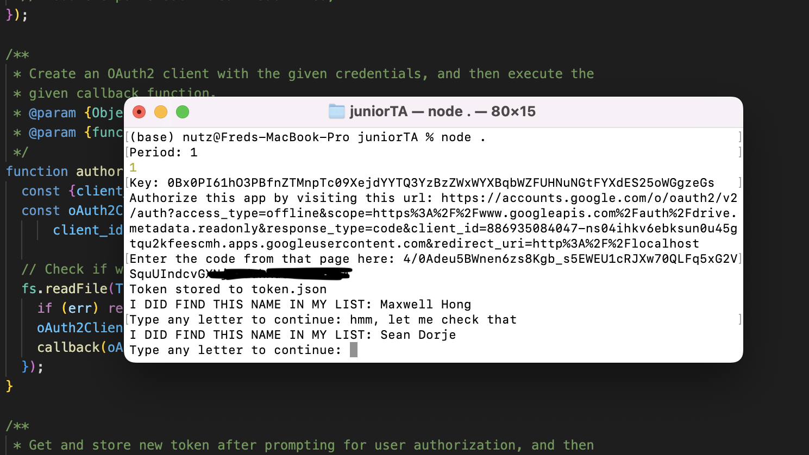

# juniorTA

During the pandemic, the class I was a TA for submitted homework through Google Classroom.
I was to grade on completeness and validate submissions against empty/unrelated files
(eg submitting Spanish homework for a math assignment). 
I used Google API to match the submission folder and each of the 144 students, 
leading to a **400% increase in efficiency and 100%** accuracy.
Furthermore, because this checked the owner of the file through Drive, 
I also bypassed unnamed files (where I would need to chase down the student).

The script is compiled in index.js for all five sections (period 1-5). credentials.json is used to generate token.json
which allows Google API to crawl through your folders and find the corresponding one you input.

Here was my process:

1. Run `node .`
2. Enter the period you are working on
3. Enter the slug of the folder path you want to check (the folder with all the homework submissions)
4. If you haven't previously generated a token, do so
5. The script will tell you who did not submit homework. Double check this yourself in case of spelling errors, etc.
6. Quickly go through each file in the folder and make sure they aren't random submissions (empty/unrelated file)
7. Mark scores based on completion/work-shown on the Google Sheet for grading

